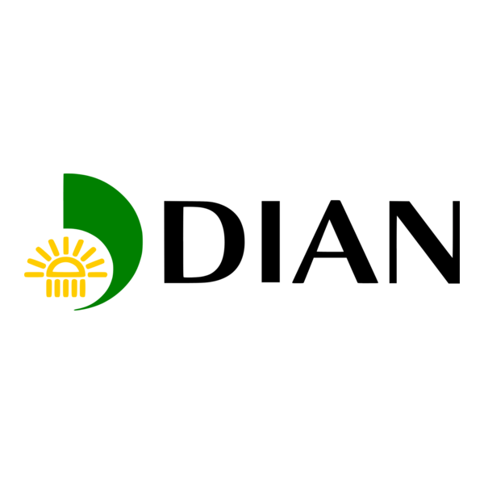

<h1 align="center">📬 Notificador Automático para Libellum</h1>

  

Este proyecto nace a partir de una necesidad real presentada por un contador con experiencia en el sector aduanero en Colombia, quien buscaba automatizar el monitoreo de nuevos registros en la plataforma de facturación electrónica **Libellum**. El proceso manual de revisar la plataforma le resultaba repetitivo y poco eficiente, por lo que se desarrolló esta solución que accede automáticamente a la página, detecta si hay nuevos documentos y, en caso afirmativo, le envía una notificación por correo electrónico. Esto permite mantenerlo informado sin necesidad de ingresar manualmente cada día.
